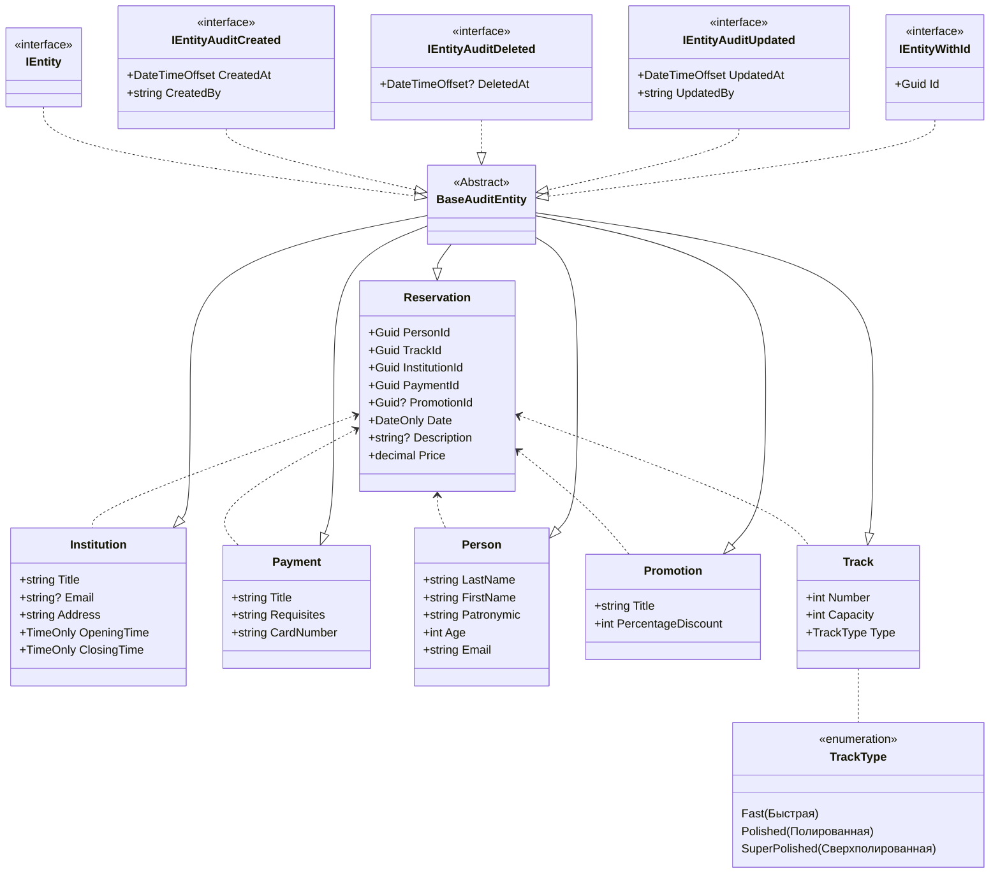

# Автоматизация бронирования дорожек в боулинге
## Схема моделей

```mermaid
    classDiagram
    Reservation <.. Institution
    Reservation <.. Payment
    Reservation <.. Person
    Reservation <.. Promotion
    Reservation <.. Track
    Track .. TrackType
    BaseAuditEntity --|> Track
    BaseAuditEntity --|> Promotion
    BaseAuditEntity --|> Person
    BaseAuditEntity --|> Institution
    BaseAuditEntity --|> Payment
    BaseAuditEntity --|> Reservation
    IEntity ..|> BaseAuditEntity
    IEntityAuditCreated ..|> BaseAuditEntity
    IEntityAuditDeleted ..|> BaseAuditEntity
    IEntityAuditUpdated ..|> BaseAuditEntity
    IEntityWithId ..|> BaseAuditEntity
    class IEntity{
        <<interface>>
    }
    class IEntityAuditCreated{
        <<interface>>
        +DateTimeOffset CreatedAt
        +string CreatedBy
    }
    class IEntityAuditDeleted{
        <<interface>>
        +DateTimeOffset? DeletedAt
    }
    class IEntityAuditUpdated{
        <<interface>>
        +DateTimeOffset UpdatedAt
        +string UpdatedBy
    }
    class IEntityWithId{
        <<interface>>
        +Guid Id
    }        
    class Promotion{
        +string Title
        +int PercentageDiscount
    }
    class Payment{
        +string Title
        +string Requisites
        +string CardNumber
    }
    class Person {
        +string LastName
        +string FirstName
        +string Patronymic
        +int Age
        +string Email
    }
    class Institution {
        +string Title
        +string? Email
        +string Address
        +TimeOnly OpeningTime
        +TimeOnly ClosingTime
    }

    class Track {
        +int Number
        +int Capacity
        +TrackType Type
    }
    class Reservation {
        +Guid PersonId 
        +Guid TrackId
        +Guid InstitutionId
        +Guid PaymentId
        +Guid? PromotionId
        +DateOnly Date
        +string? Description
        +decimal Price
    }
    class TrackType {
        <<enumeration>>
        Fast(Быстрая)
        Polished(Полированная)
        SuperPolished(Сверхполированная)
    }
    class BaseAuditEntity {
        <<Abstract>>        
    }
```
