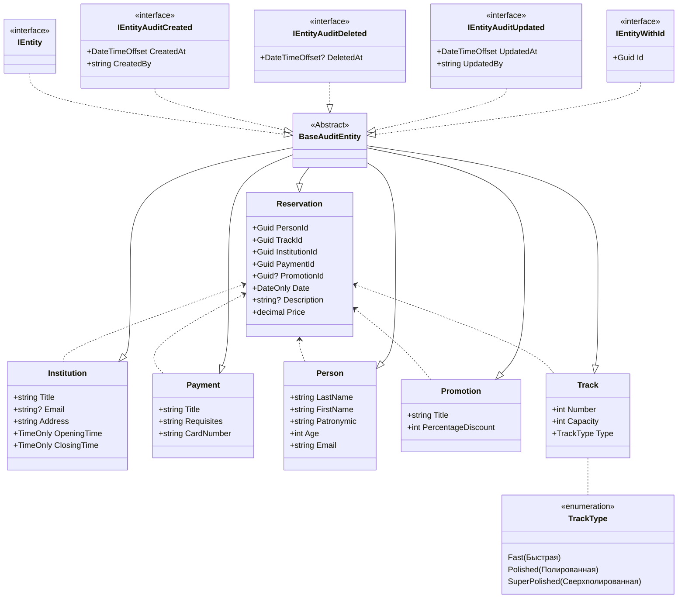

# Автоматизация бронирования дорожек в боулинге
## Автор
Альбах Данил Витальевич студент группы ип-20-3
## Схема моделей


## пример реального бизнес-сценария

## SQL скрипт
```

INSERT INTO Institution (Title, Email, Address, OpeningTime, ClosingTime)
VALUES ('Галерея "Покатай Шары"', 'info@zdravie.ru', 'ул. Ленина, 10', '08:00:00', '20:00:00'),
       ('СитиМолл "По Шарам"', 'info@tastydishes.com', 'ул. Гагарина, 15', '10:00:00', '22:00:00'),
       ('Европолис "Кегли Шарики"', 'info@activeclub.com', 'ул. Пушкина, 25', '06:30:00', '23:00:00');

INSERT INTO Payment (Title, Requisites, CardNumber)
VALUES ('Банковский перевод', 'ООО "Банк", ИНН 1234567890', '1234567890123456'),
       ('Наличные', 'Оплата при получении', ''),
       ('Онлайн платеж', 'Интернет платежная система', '9876543210987654');

INSERT INTO Person (LastName, FirstName, Patronymic, Age, Email)
VALUES ('Иванов', 'Иван', 'Иванович', 35, 'ivanov@example.com'),
       ('Петров', 'Петр', 'Петрович', 28, 'petrov@example.com'),
       ('Сидорова', 'Мария', 'Александровна', 42, 'sidorova@example.com');

INSERT INTO Promotion (Title, PercentageDiscount)
VALUES ('Скидка на товары', 10),
       ('Акция "2+1"', 0),
       ('Скидка на услуги', 15);

INSERT INTO TrackType (Name)
VALUES ('Fast'),
       ('Polished'),
       ('SuperPolished');

INSERT INTO Track (Number, Capacity, Type)
VALUES (1, 20, 1),
       (2, 15, 2),
       (3, 25, 3);


INSERT INTO Reservation
           ([PersonId]
      ,[TrackId]
      ,[InstitutionId]
      ,[PaymentId]
      ,[PromotionId]
      ,[Date]
      ,[Description]
      ,[Price])
     VALUES
           (1
           ,3
           ,1
           ,2
           ,1
           ,GETDATE()
           ,'как можно скорее'
           ,2500
			)

INSERT INTO Reservation
           ([PersonId]
      ,[TrackId]
      ,[InstitutionId]
      ,[PaymentId]
      ,[PromotionId]
      ,[Date]
      ,[Description]
      ,[Price])
     VALUES
           (2
           ,4
           ,2
           ,3
           ,2
           ,GETDATE()
           ,'важно'
           ,3000
			)

INSERT INTO Reservation
           ([PersonId]
      ,[TrackId]
      ,[InstitutionId]
      ,[PaymentId]
      ,[PromotionId]
      ,[Date]
      ,[Description]
      ,[Price])
     VALUES
           (3
           ,5
           ,3
           ,4
           ,3
           ,GETDATE()
           ,'не срочно'
           ,1500
			)
```
